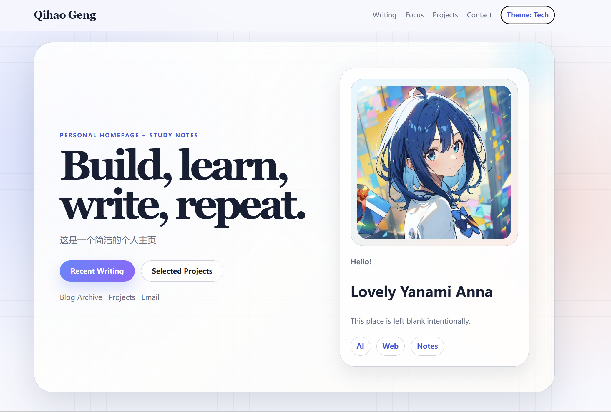
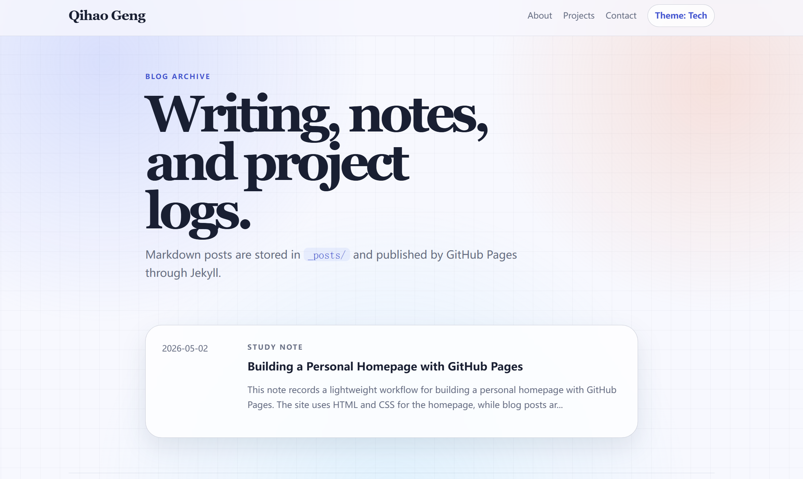

# 个人主页课程报告

## 1. 个人主页介绍

本项目实现了一个可部署到 GitHub Pages 的个人主页。主页主要内容包括个人简介、学习方向、项目展示、博客入口和联系方式。网页主体语言为英文。

### 页面结构与功能说明：

- 首页 `index.html`：展示个人简介、兴趣标签、学习方向、最近博客、项目展示和联系方式。
- 博客页 `blog.html`：作为博客归档入口，通过 Jekyll 自动读取 `_posts/` 中的 Markdown 文章。
- 文章模板 `_layouts/post.html`：统一控制博客文章页面结构。
- 博客文章 `_posts` : 编写博客文章。
- 样式文件 `assets/style.css`：提供现代清爽、科技感和莫兰迪风格两套视觉效果，并支持移动端适配。
- 主题脚本 `assets/theme.js`：实现导航栏主题按钮和页面滚动进度条，用户可以在默认科技风和莫兰迪风之间切换。

### 主页访问链接：

```text
https://qhg13.github.io/
```


## 2. 博客
### 博客主题
寻找强连通分量的tarjan算法

### 主要内容
根据tarjan在1972的文章介绍了其提出的寻找强连通分量的算法. 

主体结构是 : 首先引入一些定义并提出要解决的问题, 随后逐步探索强连通分量在有向图中的结构, 在结构比较清楚之后引入了关键量 LOWLINK 解决问题.


### 博客访问方式：

- 从首页顶部导航栏点击 `Writing`。
- 从首页首屏点击 `Recent Writing`。
- 从首页写作区域点击 `Recent Writing` 或 `Open Archive`。


## 3. 实现过程

### 使用的主要工具或技术：

- HTML：编写主页、博客归档和文章模板结构。
- CSS：实现页面布局、卡片边框、光晕背景、网格纹理、按钮动效、莫兰迪主题和响应式适配。
- JavaScript：监听主题按钮点击，切换页面根元素的 `data-theme` 属性，并通过 `localStorage` 保存用户选择。
- SVG：提供默认头像占位图。
- Markdown：用于撰写博客文章。
- Jekyll：用于将 Markdown 博客文章渲染为静态网页。
- Liquid：用于在博客归档页面自动遍历文章列表。
- GitHub Pages：用于静态网页托管和线上访问。
- Git：用于后续版本管理和代码推送，实际 Git 操作由用户自行执行。

### 网页搭建和部署过程：

1. 参考示例主页的信息结构，确定项目包含首页、博客归档、文章模板和项目展示区域。
2. 编写 `index.html`，实现英文个人简介、学习方向、最近文章、项目展示和联系方式。
3. 编写 `blog.html`，使用 Jekyll 模板语法自动展示 `_posts/` 中的文章。
4. 编写 `_layouts/post.html`，统一博客文章页面结构。
5. 编写 `_posts/2026-05-02-github-pages-homepage.md`，作为 Markdown 示例文章。
6. 编写 `assets/style.css`，将页面外观调整为现代清爽、科技感和莫兰迪风格可切换的设计，并优化学习路线和博客页布局。
7. 编写 `assets/theme.js`，实现浏览器端主题切换、主题记忆功能和滚动进度显示。
8. 将项目推送到 `你的GitHub用户名.github.io` 仓库。
9. 在 GitHub 仓库设置中启用 GitHub Pages，从 `main` 分支根目录部署。

### 遇到的问题及解决方法：

- 问题：手写 HTML 博客不利于长期维护。
  解决方法：改用 GitHub Pages 原生支持的 `Markdown + Jekyll`，以后只需在 `_posts/` 中写 Markdown。
- 问题：GitHub Pages 公开仓库会暴露网页源码。
  解决方法：仅放置可公开内容，不在仓库中保存密钥、Token、隐私资料或未公开文件。
- 问题：手机屏幕宽度较小，多列卡片和首屏双栏布局会显得拥挤。
  解决方法：增加移动端断点，将首屏、卡片、博客归档和项目展示调整为单列布局，并缩小边距、圆角和按钮尺寸。
- 问题：单一配色不够个性化。
  解决方法：使用 CSS 变量组织颜色，新增低饱和莫兰迪主题，通过 JavaScript 切换根元素主题属性。

GitHub Pages 部署个人网页的优势：

- 免费托管静态网页，适合个人主页、课程项目展示和公开博客。
- 与 GitHub 仓库和版本管理结合紧密，修改记录清晰。
- 原生支持 Jekyll，可以直接用 Markdown 维护博客。
=

GitHub Pages 部署个人网页的局限性：

- 主要适合静态网站，不适合需要数据库、用户登录或后端接口的动态应用。
- 如果使用公开仓库，HTML、CSS、Markdown、图片和提交历史通常都会公开。
- 国内访问速度和稳定性可能受网络环境影响。
- 构建环境有限，复杂前端工程或自定义插件需要额外部署方案。

## 4.AI Agent 使用说明
- 主要使用 opencode cli, 接入 gpt-5.5 模型, 一些小问题也询问了 gemini。
- 计划由我和AI讨论, 传入了助教的主页让其参考实现, 随后 Build 基本全盘由Agent完成。
- 我做的修改为个人信息的修改以及博客内容的编写。
- AI Agent 很强大, 感觉一年内进化了非常多。

## 5.结果展示

<figure>
  
  <figcaption>Figure 1. 个人主页截图。</figcaption>
</figure>

<figure>
  
  <figcaption>Figure 2. 博客页截图。</figcaption>
</figure>
